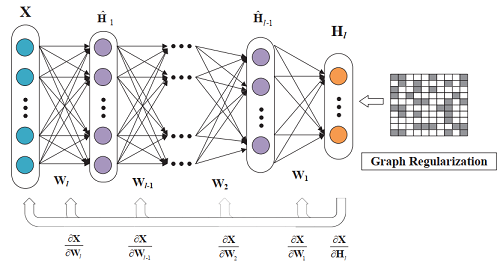
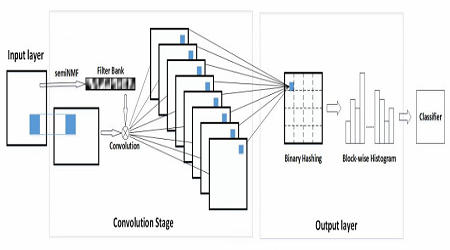

<ol>
<h1>Publications</h1>

<li>
	<b>H.</b> <b>Huang</b>, Z. Yang, Z. Li and W. Sun, "Deep Graph semi-NMF algorithm and its convergence", is submitted to Circuits, Systems, and Signal Processing, 2020. (under review)  [Paper is comming soon]		[Code is comming soon] 
	(Besides, I have released a <a href="https://github.com/libertyhhn/DeepMF" style="text-decoration:underline;">[Matlab Library for Deep Matrix Factorization models]</a> with data clustering.)
          
		         
			
</li> 
<li>
	<b>H.</b> <b>Huang</b>, Z. Yang, N. Liang, and Z. Li, "Semi-NMF network for image classification", in 2019 Chinese Control Conference (CCC). <a href="https://github.com/libertyhhn/libertyhhn.github.io/blob/master/publications/19%20CCC%20Semi-NMF%20network%20for%20image%20classification.pdf" style="text-decoration:underline;">
			[Paper]</a>	
	<a href="https://github.com/libertyhhn/SNnet" style="text-decoration:underline;">
			[Code for Matlab]</a> 
          
		         			
<!--		<a href="https://github.com/libertyhhn/DeepMF" style="text-decoration:underline;">
			[Code for Matlab]</a>
-->
	</li> 
	<li>
	<b>H.</b> <b>Huang</b>, N. Liang, W. Yan, Z. Yang and W. Sun, "Deep Matrix Factorization with Multi-view Data" ,20th IEEE International Conference on Data Mining Workshops (ICDMW)，2020. <a> [Paper is coming soon]</a>
		<a href="https://github.com/libertyhhn/PartiallySharedDMF" style="text-decoration:underline;"> [Code for Matlab]</a> 		
           
<!--		         
			<a href="https://github.com/libertyhhn/libertyhhn.github.io/blob/master/publications/19%20CCC%20Semi-NMF%20network%20for%20image%20classification.pdf" style="text-decoration:underline;">
			[Paper]</a>
		<a href="https://github.com/libertyhhn/DeepMF" style="text-decoration:underline;">
			[Code for Matlab]</a>
-->
	</li> 
	<li>
	  W. Han, S. Xie, Z. Yang, S. Zhou and <b> H.</b> <b>Huang</b>, "Heart sound classification using the SNMFNet classifier", <i>Physiological measurement</i>, 40(10), 105003, 2019.  <a href="https://iopscience.iop.org/article/10.1088/1361-6579/ab45c8/meta" style="text-decoration:underline;">[Paper]</a>
		<a href="https://github.com/libertyhhn/SNMFNet" style="text-decoration:underline;">[Code for Python]</a>
	</li> 
 
   
 
   <h1>Project</h1>
   

   <ul>
	   <li>
		   <B> Q&A system for epilepsy diagnostic </B>  
		   Project Leader, 2019 Seed Program Project in GDUT. 
		   
	   </li> 
	<li> <B>A Laser Beam Profiler System</B>  
		Project Leader, 2017 Guangdong Undergraduate Training Program for Innovation and Entrepreneurship. 
		
	         	
		<a href="https://github.com/libertyhhn/LaserQualityMeasurementSoftware" style="text-decoration:underline;">
			[Code for LabVIEW]</a>
		<a href="https://github.com/libertyhhn/libertyhhn.github.io/blob/master/research/Chinese%20Technical%20Reports%20of%20Laser%20Beam%20Profiler.pdf" style="text-decoration:underline;">
			[Chinese Technical Reports]
		</a> </li>
   </ul>
   
 

   <h1>Competition Award</h1>
   

   <ul>
	<li>
		A Laser Beam Quality Analysis Instrument.(激光光束质量分析仪)
		 
		Second Prize in Guangdong 14^th Challenge Cup under the guidance of Prof. Junwen Xue.
		 
		<a href="https://github.com/libertyhhn/LaserQualityMeasurementSoftware" style="text-decoration:underline;">
			[Code for LabVIEW]
		</a>
		<a href="https://www.bilibili.com/video/av55328647" style="text-decoration:underline;">
			[Video in bilibili]
		</a>  
	   </li>
	<li>Measurement of Flame Flow Field with Double-path Schlieren Structure Using Mobile Phone as Light Source.
		（用手机做光源的双光程纹影结构对火焰流场的测量）
		 
		Second Prize in Guangdong 18^th College Physics Experiment Design Competition under the guidance of Prof. Junwen Xue.
		 
	        <a href="https://www.bilibili.com/video/av55328155" style="text-decoration:underline;">
			[Video in bilibili]
		</a>
	   </li>
   </ul>
   
 
