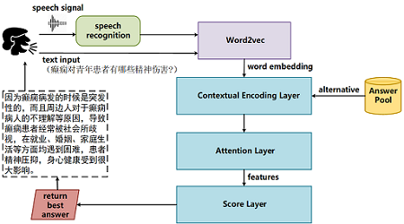
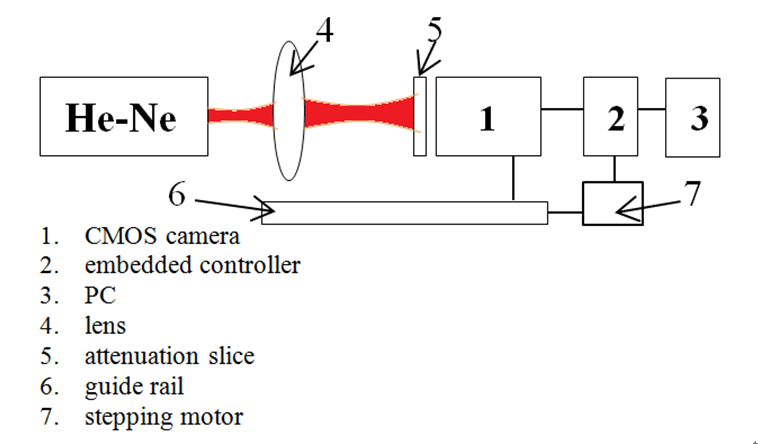

<ol>
<h1>Publications</h1>

<li>
	<b>H.</b> <b>Huang</b>, G. Zhou, N. Liang, Q. Zhao and S. Xie, "Diverse Deep Matrix Factorization with Hypergraph Regularization for Multi-view Data Representation",  IEEE/CAA Journal of Automatica Sinica (IEEE JAS), 2022.     
		<a href="https://ieeexplore.ieee.org/document/9910368/authors#authors" style="text-decoration:underline;">[Paper]</a>		
	<a href="https://github.com/libertyhhn/DiverseDMF" style="text-decoration:underline;">
			[Code for Matlab]</a> 
</li> 
	<li>
	Y. Yu, G. Zhou, <b>H.</b> <b>Huang</b>, S. Xie and Q. Zhao, "A semi-supervised label-driven auto-weighted strategy for multi-view data classification",  Knowledge-Based Systems (KBS), 2022.     
		<a href="https://www.sciencedirect.com/science/article/pii/S0950705122008577?ref=cra_js_challenge&fr=RR-1" style="text-decoration:underline;">[Paper]</a>		
	<a href="https://github.com/isYuyuanYu/Label-driven-auto-weighted-constrained-K-means" style="text-decoration:underline;">
			[Code for Matlab]</a> 
</li> 
	<li>
	<b>H.</b> <b>Huang</b>, Y. Luo, G. Zhou and Q. Zhao, "Multi-view Data Representation via Deep Autoencoder-like Nonnegative Matrix Factorization",  IEEE International Conference on Acoustics, Speech and Signal Processing (ICASSP), 2022.     
		<a href="https://ieeexplore.ieee.org/abstract/document/9747857" style="text-decoration:underline;">[Paper]</a>		
	[Code is comming soon] 
</li> 
<li>
	<b>H.</b> <b>Huang</b>, Z. Yang, Z. Li and W. Sun, "Deep Graph semi-NMF algorithm and its convergence",  Circuits, Systems, and Signal Processing, 2021.           <a href="https://link.springer.com/article/10.1007/s00034-021-01833-3" style="text-decoration:underline;">[Paper]</a>			
    <a href="https://github.com/libertyhhn/DeepMF" style="text-decoration:underline;">[Matlab Library for Deep Matrix Factorization models]</a> with data clustering.
		         			
</li> 
<li>
	<b>H.</b> <b>Huang</b>, Z. Yang, N. Liang, and Z. Li, "Semi-NMF network for image classification", in 2019 Chinese Control Conference (CCC). <a href="https://github.com/libertyhhn/libertyhhn.github.io/blob/master/publications/19%20CCC%20Semi-NMF%20network%20for%20image%20classification.pdf" style="text-decoration:underline;">
			[Paper]</a>	
	<a href="https://github.com/libertyhhn/SNnet" style="text-decoration:underline;">
			[Code for Matlab]</a> 		
<!--		<a href="https://github.com/libertyhhn/DeepMF" style="text-decoration:underline;">
			[Code for Matlab]</a>
-->
	</li> 
	<li>
	<b>H.</b> <b>Huang</b>, N. Liang, W. Yan, Z. Yang and W. Sun, "Deep Matrix Factorization with Multi-view Data" ,20th IEEE International Conference on Data Mining Workshops (ICDMW)，2020. <a href="https://ieeexplore.ieee.org/document/9346449" style="text-decoration:underline;">
			[Paper]</a>	
		<a href="https://github.com/libertyhhn/PartiallySharedDMF" style="text-decoration:underline;"> [Code for Matlab]</a> 		
<!--		         
			<a href="https://github.com/libertyhhn/libertyhhn.github.io/blob/master/publications/19%20CCC%20Semi-NMF%20network%20for%20image%20classification.pdf" style="text-decoration:underline;">
			[Paper]</a>
		<a href="https://github.com/libertyhhn/DeepMF" style="text-decoration:underline;">
			[Code for Matlab]</a>
-->
	</li> 
	<li>
	  W. Han, S. Xie, Z. Yang, S. Zhou and <b> H.</b> <b>Huang</b>, "Heart sound classification using the SNMFNet classifier", <i>Physiological measurement</i>, 40(10), 105003, 2019.  <a href="https://iopscience.iop.org/article/10.1088/1361-6579/ab45c8/meta" style="text-decoration:underline;">[Paper]</a>
		<a href="https://github.com/libertyhhn/SNMFNet" style="text-decoration:underline;">[Code for Python]</a>
	</li> 
 
   
 
	<h1>Services</h1>

<li> 
	Reviewer for IEEE T-NNLS
	Reviewer for ICML 2022
	Internation Volunteer for WINE 2020
	</li> 
	 
 
   <h1>Project</h1>
   

   <ul>
	   <li>
		   <B> Q&A system for epilepsy diagnostic </B>  
		   Project Leader, 2019 Seed Program Project in GDUT. 
		   
		    
		   <a href="https://link.springer.com/article/10.1007/s10489-021-02212-w" style="text-decoration:underline;">
			[Paper]
		</a>
		<a href="https://github.com/chenxichen95/MCFN" style="text-decoration:underline;">
			[Code for Python]</a>
	   </li> 
	<li> <B>A Laser Beam Profiler System</B>  
		Project Leader, 2017 Guangdong Undergraduate Training Program for Innovation and Entrepreneurship. 
		
	         	
<a href="https://github.com/libertyhhn/libertyhhn.github.io/blob/master/research/Chinese%20Technical%20Reports%20of%20Laser%20Beam%20Profiler.pdf" style="text-decoration:underline;">
			[Chinese Technical Reports]
		</a>
		<a href="https://github.com/libertyhhn/LaserQualityMeasurementSoftware" style="text-decoration:underline;">
			[Code for LabVIEW]</a>
 </li>
   </ul>
   
 

   <h1>Competition Award</h1>
   

   <ul>
	<li>
		A Laser Beam Quality Analysis Instrument.(激光光束质量分析仪)
		 
		Second Prize in Guangdong 14^th Challenge Cup under the guidance of Prof. Junwen Xue.
		 
		<a href="https://github.com/libertyhhn/LaserQualityMeasurementSoftware" style="text-decoration:underline;">
			[Code for LabVIEW]
		</a>
		<a href="https://www.bilibili.com/video/av55328647" style="text-decoration:underline;">
			[Video in bilibili]
		</a>  
	   </li>
	<li>Measurement of Flame Flow Field with Double-path Schlieren Structure Using Mobile Phone as Light Source.
		（用手机做光源的双光程纹影结构对火焰流场的测量）
		 
		Second Prize in Guangdong 18^th College Physics Experiment Design Competition under the guidance of Prof. Junwen Xue.
		 
	        <a href="https://www.bilibili.com/video/av55328155" style="text-decoration:underline;">
			[Video in bilibili]
		</a>
	   </li>
   </ul>
   
 
