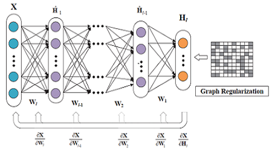
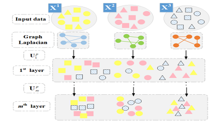

<ol>
<h1>Publications</h1>

<ul>
<li>
	<B>Deep Graph semi-NMF algorithm and its convergence </B>  
          
		         
			<a href="https://github.com/libertyhhn/libertyhhn.github.io/blob/master/publications/20%20Deep%20Graph%20semi-NMF%20algorithm%20and%20its%20convergence.pdf" style="text-decoration:underline;">
			[Paper is submitted to Neurocomputing]</a>
		<a href="https://github.com/libertyhhn/DeepMF" style="text-decoration:underline;">
			[Code for Matlab]</a>
</li> 
<li>
		<B>Semi-NMF network for image classification</B>  
          
		         
			<a href="https://github.com/libertyhhn/libertyhhn.github.io/blob/master/publications/19%20CCC%20Semi-NMF%20network%20for%20image%20classification.pdf" style="text-decoration:underline;">
			[Paper]</a>
<!--		<a href="https://github.com/libertyhhn/DeepMF" style="text-decoration:underline;">
			[Code for Matlab]</a>
-->
	</li> 
	<li>
		<B>Deep Matrix Factorization with Multi-view Data</B>  
           
		<a> [Paper is under review]</a>
		<a> [Code is coming soon]</a>
<!--		         
			<a href="https://github.com/libertyhhn/libertyhhn.github.io/blob/master/publications/19%20CCC%20Semi-NMF%20network%20for%20image%20classification.pdf" style="text-decoration:underline;">
			[Paper]</a>
		<a href="https://github.com/libertyhhn/DeepMF" style="text-decoration:underline;">
			[Code for Matlab]</a>
-->
	</li> 
 
</ul>
   
 
   <h1>Project</h1>
   

   <ul>
	   <li>
		   <B> Q&A system for epilepsy diagnostic </B>  
		   Project Leader, 2019 Seed Program Project in GDUT. 
		   
	   </li> 
	<li> <B>A Laser Beam Profiler System</B>  
		Project Leader, 2017 Guangdong Undergraduate Training Program for Innovation and Entrepreneurship. 
		
	         	
		<a href="https://github.com/libertyhhn/LaserQualityMeasurementSoftware" style="text-decoration:underline;">
			[Code for LabVIEW]</a>
		<a href="https://github.com/libertyhhn/libertyhhn.github.io/blob/master/research/Chinese%20Technical%20Reports%20of%20Laser%20Beam%20Profiler.pdf" style="text-decoration:underline;">
			[Chinese Technical Reports]
		</a> </li>
   </ul>
   
 

   <h1>Competition Award</h1>
   

   <ul>
	<li>
		A Laser Beam Quality Analysis Instrument.(激光光束质量分析仪)
		 
		Second Prize in Guangdong 14^th Challenge Cup under the guidance of Prof. Junwen Xue.
		 
		<a href="https://github.com/libertyhhn/LaserQualityMeasurementSoftware" style="text-decoration:underline;">
			[The code of the project]
		</a>
		<a href="https://www.bilibili.com/video/av55328647" style="text-decoration:underline;">
			[Video in bilibili]
		</a>  
	   </li>
	<li>Measurement of Flame Flow Field with Double-path Schlieren Structure Using Mobile Phone as Light Source.
		（用手机做光源的双光程纹影结构对火焰流场的测量）
		 
		Second Prize in Guangdong 18^th College Physics Experiment Design Competition under the guidance of Prof. Junwen Xue.
		 
	        <a href="https://www.bilibili.com/video/av55328155" style="text-decoration:underline;">
			[Video in bilibili]
		</a>
	   </li>
   </ul>
   
 
